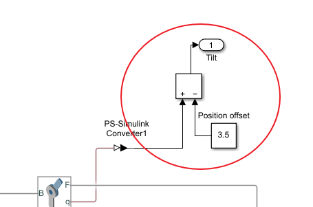

Improve the EDPR iCub head – Simulations
========================================

# 1. Prerequisites
TODO

# 2. Used tools
TODO

# 3. Model

## 3.1. Complete model

The complete model is divided into the following parts:
- Mechanics
- Motor
- Control
- Reference

## 3.2. Mechanics

The mechanics part of the model is generated directly from the Creo CAD.

Some minor fix should be done after the Creo generation:
- Remove SixDof
- Check gravity direction
- Add the out position, velocity port and add the in torque port    
     
    
- Manage the position offset  
  

## 3.3. Control

The control block is shown in the following figure:  

  

It is a discrete PI. Note the saturation.

## 3.4. Motor
The motor used is the Model 1524SR12 Faulhaber, the gearbox is the model series 15/8 144:1 Faulhaber.   
The motor block is shown in the following figure:  

  

The gearbox inertia is calculated approximating it to a cylinder with the same rage and length.  
The motor damping formula is:  
$k_t \cdot i_{\text{noload}} = \lambda \cdot \omega_{\text{noload}}$

TODO add motor data

## 3.5. Reference

For reference, a polynomial curve is used.  
  

# 2. Running the model
TODO
