Study of the eyes tilting mechanism
===================================
This model describes the eyes mechanism that is present on a particular iCub head by EDPR. The mechanism seems not to be able to move correctly the eyes following the reference curve. For this reason, we decide to model all the parts and check for problems.

# 1. Prerequisites

- Matlab/Simulink/Simscape 2021a with toolboxes
- git

Clone the repository:
```bash
git clone https://github.com/icub-tech-iit/study-improve-head-edpr.git
```

# 2. Used tools
We developed the model using Simulink, Simscape and Creo CAD.  
Open the model project named **Eyestiltmotorsizing.prj** in folder study-improve-head-edpr.

# 3. Model

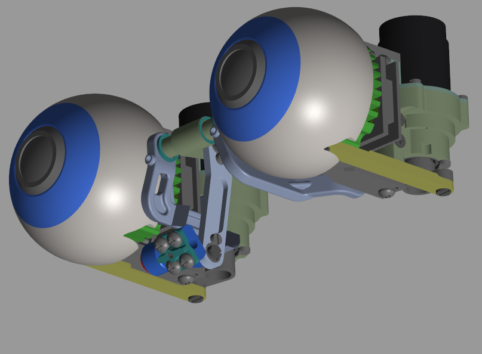

## 3.1. Complete model

The complete model is divided into the following parts:
- Mechanics
- Motor
- Control
- Reference

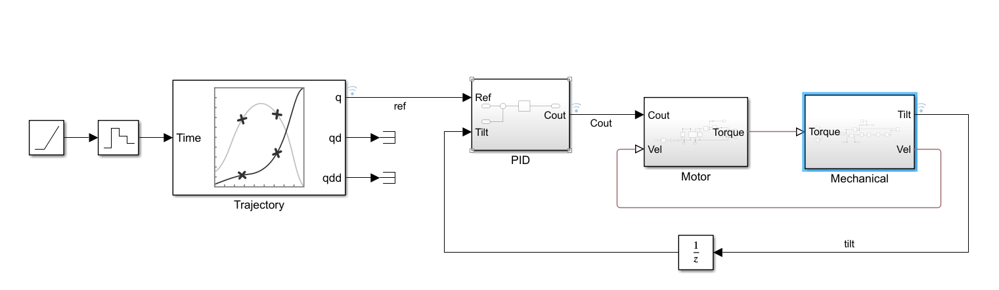


## 3.2. Mechanics

The mechanics part of the model is generated directly from the Creo CAD;
and then we imported it into SimScape. 
To generate it, execute Matlab and then on the command window:
```matlab
cd study-improve-head-edpr\eyes-tilt-motor-sizing
smimport('models/resources_simscape/ICUB3_020_G_300.xml');
```
See also the official [import procedure](https://it.mathworks.com/help/physmod/sm/ug/import-a-cad-assembly-model.html#:~:text=You%20import%20a%20CAD%20model,body%20geometries%20for%20visualization%20purposes).

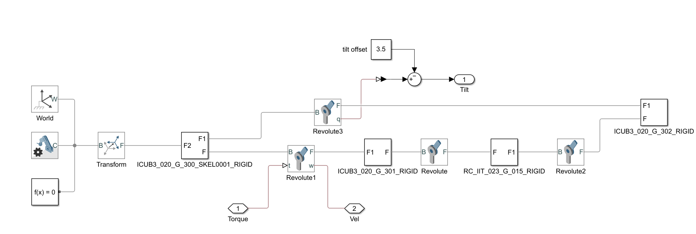

Some minor fixes should be done after the Creo generation:
- Remove SixDof
- Check gravity direction
- Add the out position, velocity port and add the in torque port  

<br><br>
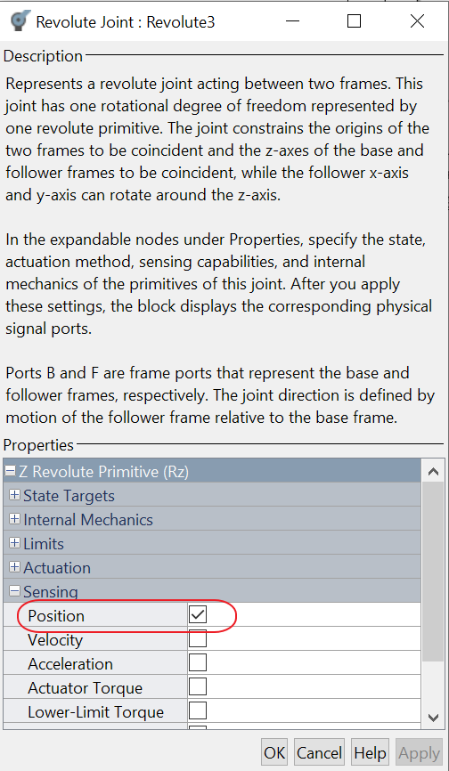  
<br><br>
    
- Manage the position offset  
  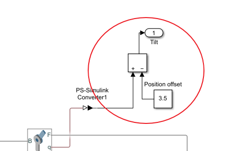
- Add the out ports to the model (Tilt, Vel) and the in port (Torque).

## 3.3. Control

The control block is shown in the following figure:  

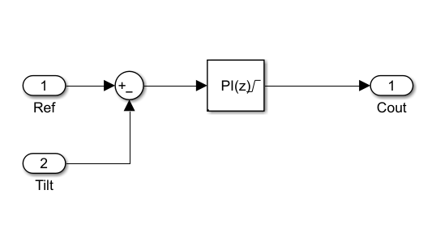  

It is a discrete PI.  
Configured parameters:
|Name|Value|
|-|-|
|Proportional|10|
|Integral|10|

Limit output between +-100:  
<br>
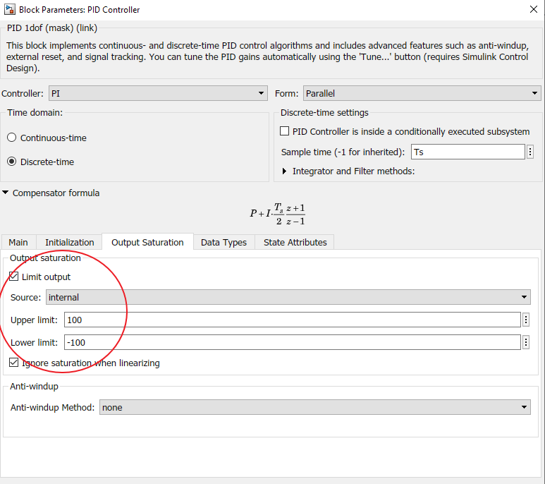 


## 3.4. Motor
The motor used is the Model 1524SR12 Faulhaber, the gearbox is the model series 15/8 141:1 Faulhaber.  
The motor block is shown in the following figure:  

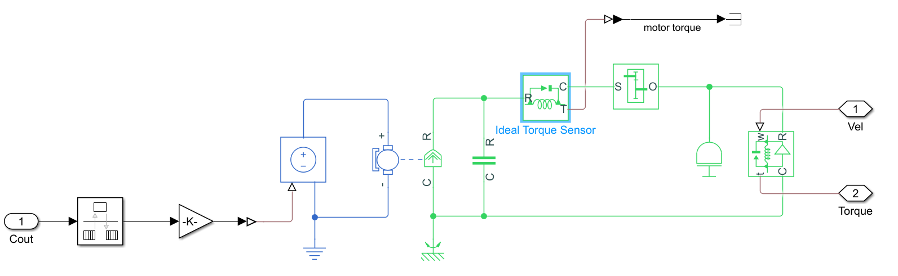  

The gearbox inertia is calculated approximating it to a cylinder with the same range and length $I=\frac{mr^{2}}{2}$.  
The motor damping formula is:  
$\lambda=\frac{k_t \cdot i_{\text{noload}}}{\omega_{\text{noload}}}$
where $k_t$ is the torque constant, $i_{noload}$ is the no load current, $\omega_{noload}$ is the no load speed, and $\lambda$ is the desired damping. 


Motor specifications used:
|Name|Value|Uom|
|-|-|-|
|Nominal voltage|12|v|
|Armature resistance|19.8|Ohm|
|Armature inductance|250|uH|
|Torque constant|11.4|mN*m/A|
|Armature resistance|19.8|Ohm|
|Rotor inertia|0.65|g*cm^2|
|Rotor dumping|1.266e-5|m*mN/rpm|
|Armature resistance|19.8|Ohm|
|No load speed|9900|rpm|
|No load current|0.011|A|

Gearbox specifications used:
|Name|Value|Uom|
|-|-|-|
|Gearbox ratio|141:1||
|Inertia|7.68|g*cm^2|
|Breakaway friction torque|0.13|mN*m|
|Breakaway friction velocity|0.01|rad/s|
|Coulomb friction torque|0.13|mN*m|
|Cylinder range|8|mm|
|Cylinder lenght|32|mm|
|Mass|24|g|

## 3.5. Reference

For reference, we used a polynomial curve.  
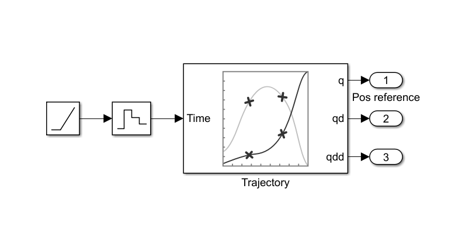  

**Reference curve:**

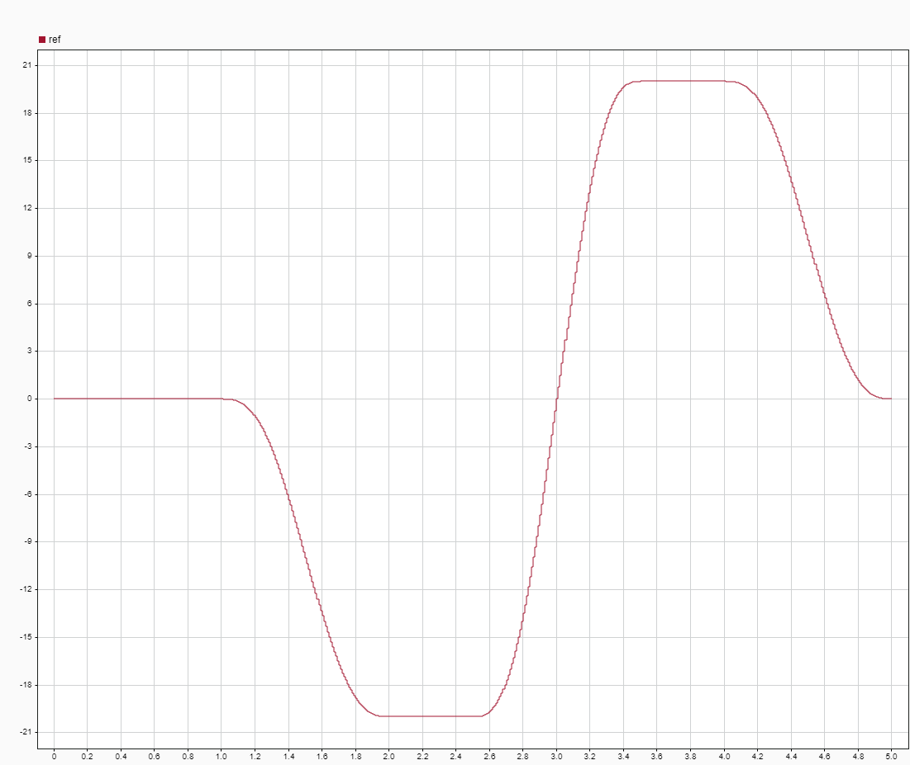  

## 3.6. Model without motor
It is also available a model without the motor:
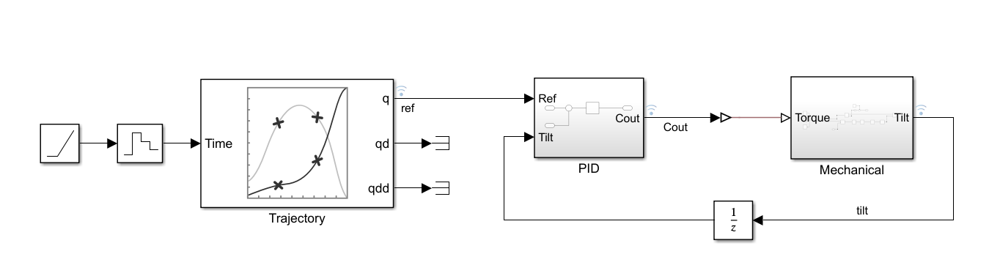  


# 2. Running the model

Running the model(complete with the motor) with the given reference curve.

**Position-Reference in degree against time**:

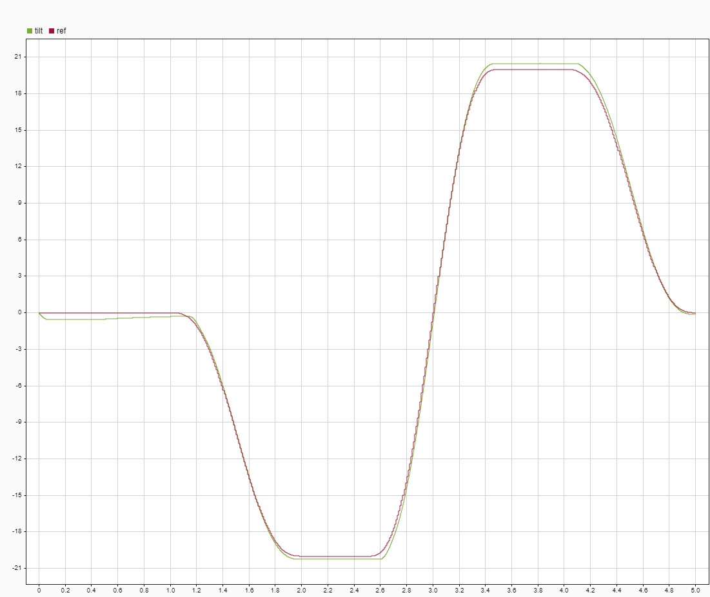  

The motor follows the reference.

**Torque N*m against time:**

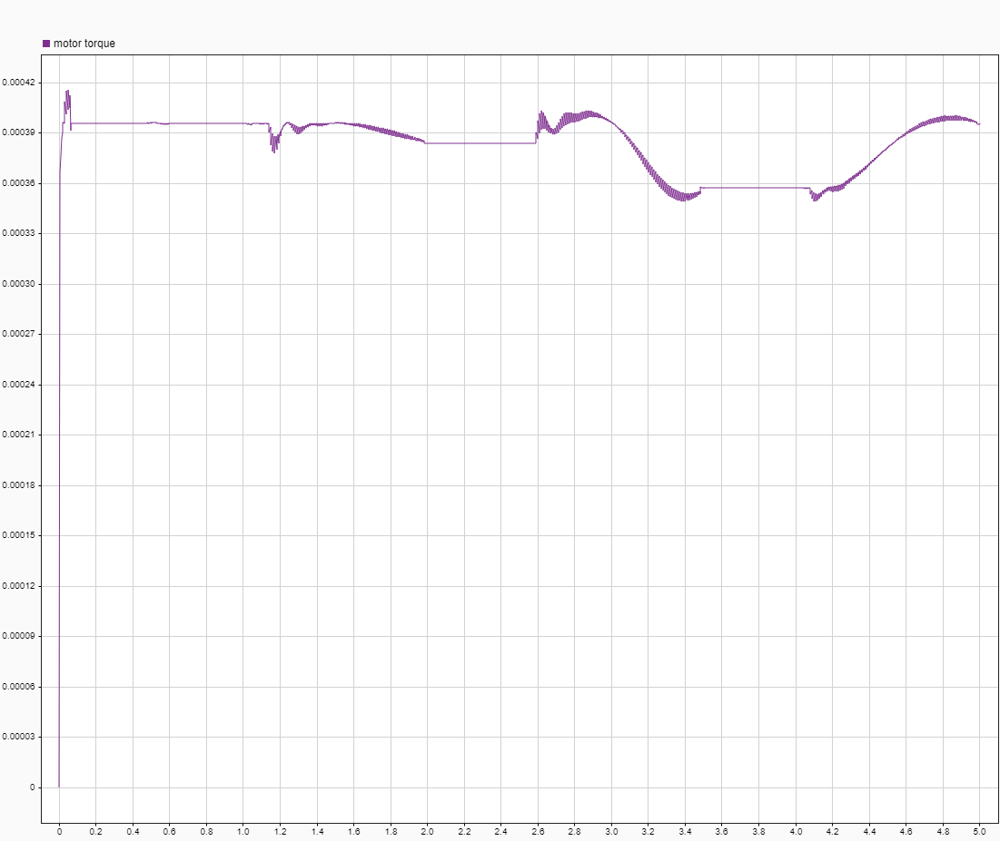  

The max torque requested by the motor is around 0.00040 Nm 

**Input voltage against time**:

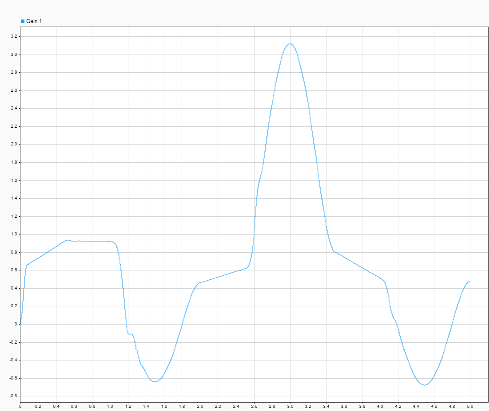 

The voltage remains within the limits +-12volt.

For completness **Position-reference-pid_out** against time: 
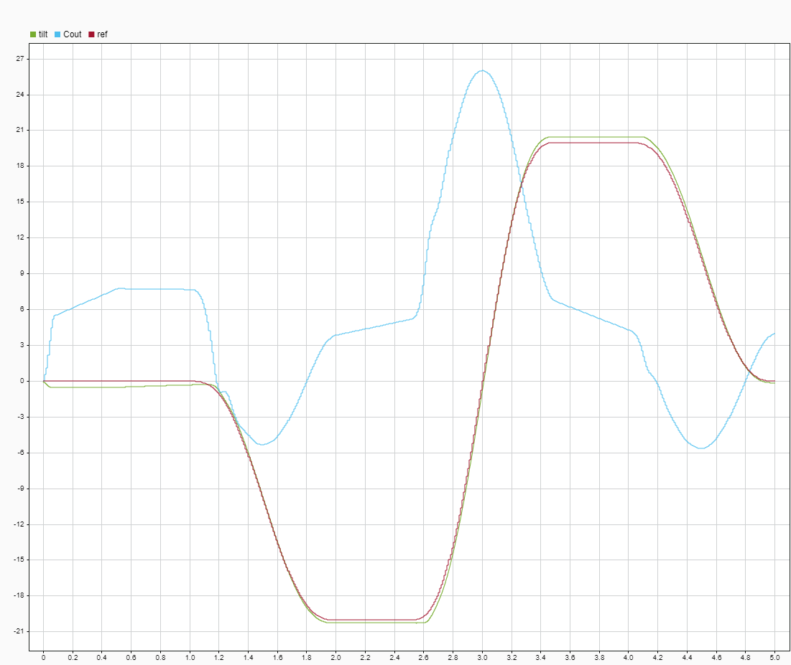  

# 3. Conclusion

The physical system described by the model can follow the given trajectory because the maximum torque value required is well within its specifications.
Maximum requested torque 0.40 mN*m and for motor specification maximum deliverable torque.

  
