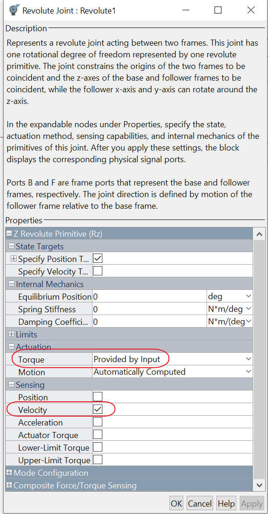

Study of the eyes tilting mechanism
===================================

# 1. Prerequisites
TODO

# 2. Used tools
TODO

# 3. Model

## 3.1. Complete model

The complete model is divided into the following parts:
- Mechanics
- Motor
- Control
- Reference

## 3.2. Mechanics

The mechanics part of the model is generated directly from the Creo CAD.

Some minor fix should be done after the Creo generation:
- Remove SixDof
- Check gravity direction
- Add the out position, velocity port and add the in torque port    
     
    
- Manage the position offset  
  

## 3.3. Control

The control block is shown in the following figure:  

  

It is a discrete PI.  
Configured parameters:
|Name|Value|Uom|
|-|-|-|
|Proportional|10||
|Integral|10||

Limit output parameters between +-100:  
 
 

## 3.4. Motor
The motor used is the Model 1524SR12 Faulhaber, the gearbox is the model series 15/8 144:1 Faulhaber.   
The motor block is shown in the following figure:  

  

The gearbox inertia is calculated approximating it to a cylinder with the same rage and length.  
The motor damping formula is:  
$k_t \cdot i_{\text{noload}} = \lambda \cdot \omega_{\text{noload}}$

Motor specifications used:
|Name|Value|Uom|
|-|-|-|
|Nominal voltage|12|v|
|Armature resistance|19.8|Ohm|
|Armature inductance|250|uH|
|Torque constant|11.4|mN*m/A|
|Armature resistance|19.8|Ohm|
|Rotor inertia|0.65|g*cm^2|
|Rotor dumping|1.266e-5|m*mN/rpm|
|Armature resistance|19.8|Ohm|

Gearbox specifications used:
|Name|Value|Uom|
|-|-|-|
|Gearbox ratio|144:1||
|Inertia|7.68|g*cm^2|
|Breakaway friction torque|0.13|mN*m|
|Breakaway friction velocity|0.01|rad/s|
|Coulomb friction torque|0.13|mN*m|

## 3.5. Reference

For reference, a polynomial curve is used.  
  

**Reference curve:**

  

# 2. Running the model

Running the model with the given reference curve.

**Position-Reference in degree against time**:

  

The motor follows the reference.

**Torque against time:**

  

The max torque requested by the motor is around 0.00040 Nm 

**Input voltage against time**:

 

the voltage remains within the limits.

For completness **Position-reference-pid_out**:

  

Video:

<video src='ICUB3_020_G_300_002.avi' width=300/>

# 3. Conclusion

The phisical system described by the model is able to follow the given trajectory because the maximum torque value required is well within its specifications.
Maximum requested torque 0.40 mN*m and for motor specification maximum deliverable torque.
