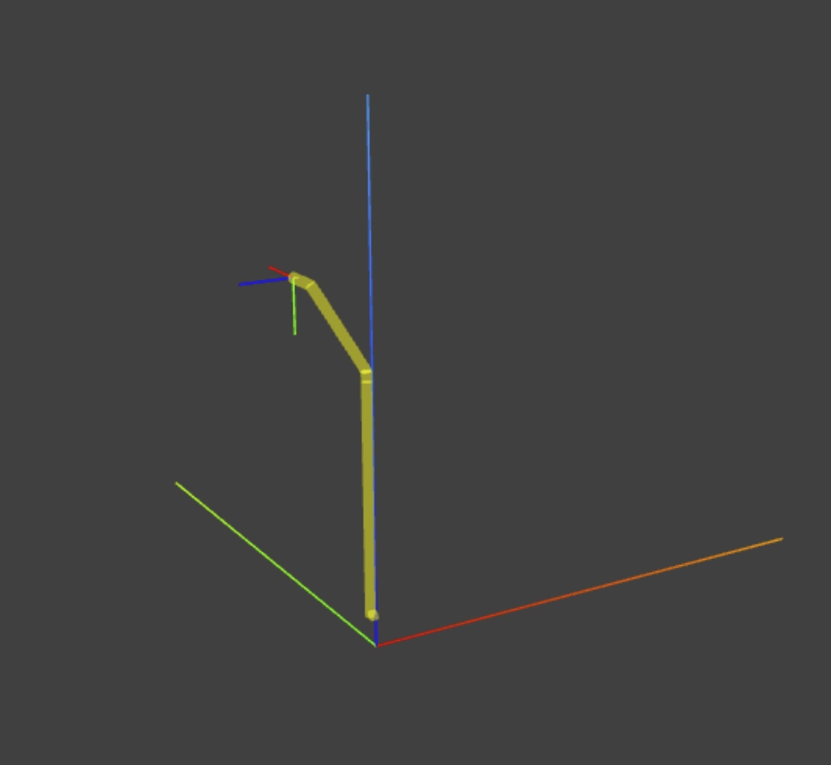

Forward Kinematics
==================

This module allows for checking easily the forward kinematics of the
EDPR eyes.

### ☁ Launch the cloud workspace
We make use of [Gitpod Cloud IDE](https://gitpod.io) as infrastructure:
- Use your GitHub credentials to sign up for Gitpod. You will have [**50 hours/month**](https://www.gitpod.io/pricing) free on public repositories.
- Learn how to deal with our [Gitpod-enabled repositories](https://github.com/robotology/community/discussions/459).
- Finally, click on the badge below to launch the Gitpod workspace!
  
  [](https://gitpod.io/#https://github.com/icub-tech-iit/study-improve-head-edpr/tree/code)

### ⚙ Build the project
Once you are in a Gitpod terminal, do the following:
```console
cd /workspace/study-improve-head-edpr/fkin
cmake -S . -B build
cmake --build build
cmake --install build
```

You are now good to go for experimenting with the kinematics ✨

### 🔘 Run the project
In the terminal, ask for a given configuration as below by providing the
type of eye, the distance `d`, and the 8 joint angles expressed in degrees:
```console
fkin --type left --d 0.0 --joints "(1.0 2.0 3.0 4.0 5.0 6.0 7.0 8.0)"
``` 

The ouput will be printed out in the console:
```console
-- type: left
-- d: 0
-- joints:  1.00000  2.00000  3.00000  4.00000  5.00000  6.00000  7.00000  8.00000
-- H:
 0.07975 -0.17761 -0.98086 -0.05359
 0.99435 -0.05498  0.09080 -0.04086
-0.07006 -0.98256  0.17222  0.35089
 0.00000  0.00000  0.00000  1.00000
```

### 👁 3D Viewer
To display the configuration, launch the following command from the terminal:
```console
view.sh
```

<div align="center">
    <figure>
        
        <figcaption>The output of the 3D Viewer.</figcaption>
    </figure>
</div>
