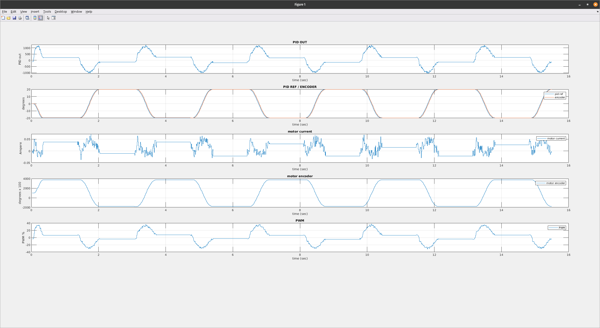
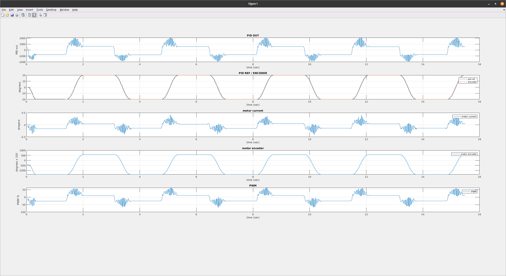
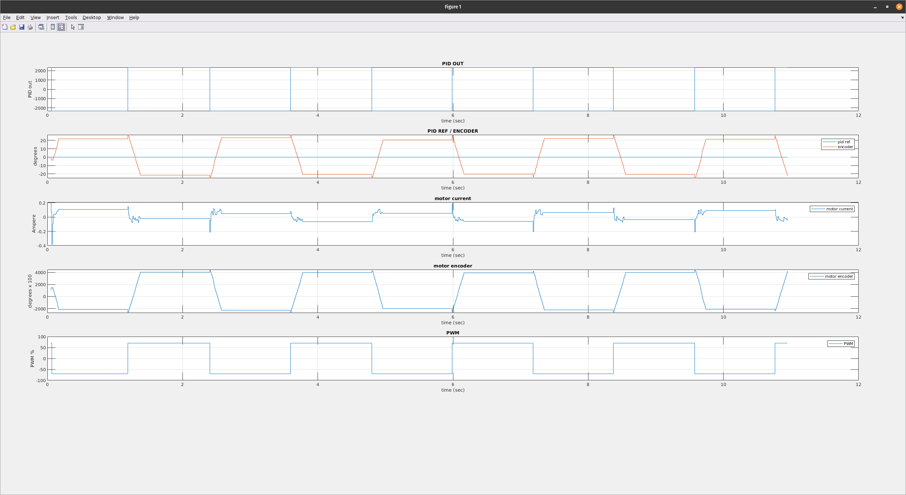
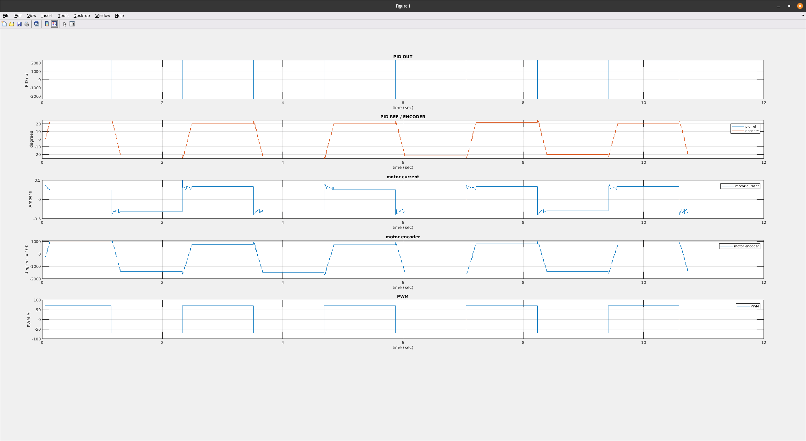

# Log joint data
The snippet code allows moving a joint between two set points both in position and PWM control mode and logs the following joint data:

- PID reference
- PID output
- Joint encoder 
- Motor current
- Motor encoder 
- PWM readouts
- Torque

The matlab script plots the logged data

## Compile the code
In order to compile the [code](src/main.cpp) do :

```console
cd src
cmake -S . -B build
cmake --build build
```

## Usage
It is possible to run the code to control the joint both in `position` and `PWM` control mode by passing to it proper parameters via CLI.
The parameters available are :

### Position
This example moves the joint 3 of the head (eyes tilt) in position mode between -20 deg and +20 deg for 5 times (pausing on each set point 1 sec) and logs the data in a file called `mylog.log`.

```console
cd src/build

./log-joint --robot-part head --joint-id 3 --set-point1 -20 --set-point2 20 --cycles 5 --control-mode position --pause 1 --log-file mylog.log
```

### PWM
This example moves the joint 3 of the head (eyes tilt) in PWM mode (setting the PWM to 70%) between -20 deg and +20 deg for 5 times (pausing on each set point 1 sec) and logs the data in a file called `mylog.log`.

```console
cd src/build

./log-joint --robot-part head --joint-id 3 --set-point1 -20 --set-point2 20 --cycles 5 --control-mode pwm --pwm-value 70 --log-file mylog.log
```

## Matlab script
Run the script by doing:
```matlab
plot_results('log_filename');
```

### Example of acquisitions plots and logs

## Position
### tilt

### pan


## Pwm 70%
### tilt

### pan


## Logs
[j3-pos.log](assets/j3-pos.log)

[j3-pwm70.log](assets/j3-pwm70.log)

[j4-pos.log](assets/j4-pos.log)

[j4-pwm70.log](assets/j4-pwm70.log)

